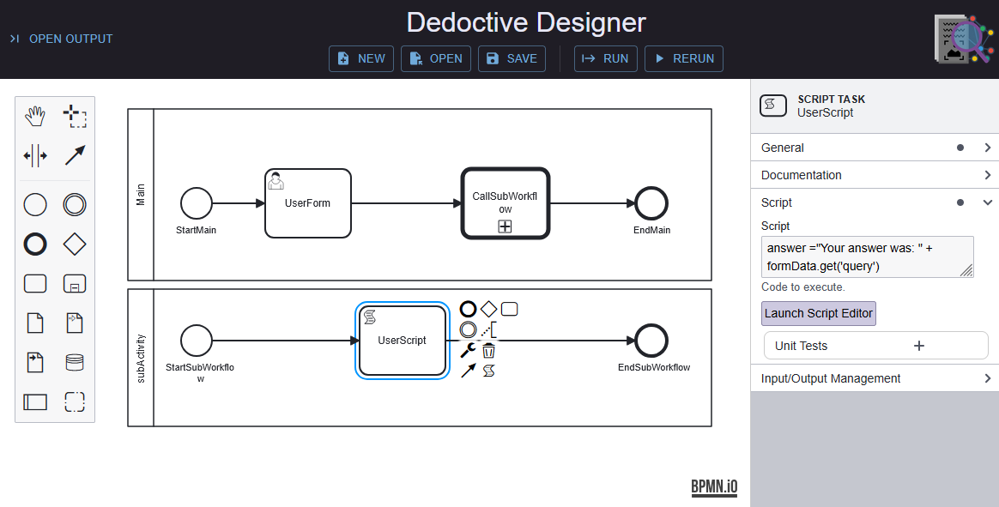

# Dedoctive Developer Edition

[dedoctive.ai](https://dedoctive.ai)

The application is targeted for standalone use by developers so that they can become familiar with designing, running and testing agentic-BPMN workflows

    

## Prerequisites
- Docker installed on your machine
    - If it's not installed: [Docker's installation guide](https://docs.docker.com/get-started/get-docker/)
## Setup Steps (DockerDesktop)
 - Open DockerDesktop
 - Download the dedoctive/dedoctive-developer-edition  image from DockerHub
   [/docker/dedoctive/dedoctive-developer-edition](https://hub.docker.com/repository/docker/dedoctive/dedoctive-developer-edition/general)
 - Setup user, workflow, and LLM api_keys
     - Dedoctive will require a registered user, defined within the ROOT_USER env variable. This is the email address that will be validated by OAuth2, before you can run Dedoctive. There can be only one user, for example
` ROOT_USER= myname@whereever.com`
    - Dedoctive will also use a local folder within which it will store any workflow BPMN files that you want to save, for example
`C:\Users\Public\deductions`	
    - Setup API keys for all of the LLMs you might want to use. This is a JSON key:value list of all of the LLM API_KEYS { <provider1/model1> : <model1key>,  <provider2/model2> : <model2key>, …}, where  <provider/model> list can be browsed here. For example (without the actual keys, we would not be that silly😀). Note this should be in a single line.
`API_KEYS =  {'gemini/gemini-2.0-flash':'xyz','openai/gpt-4.1-mini':'abc' }`
- Start the container from within DockerDesktop, and enter these Optional settings
    - Container name = 'dedoctive-developer-edition'
    - Host port = 4000
    - Volumes
        - Host path = C:\Users\Public\deductions
        - Container path = /deduction
    - Environment Variables
        -  ROOT_USER= myname@whereever.com
        -  API_KEYS = {'gemini/gemini-2.0-flash':'xyz','openai/gpt-4.1-mini':'abc' }
        -  DEDUCTION_PATH = /deduction
## Setup Steps (Windows):
- To clone the DDE repo, open a command window and run `git clone https://github.com/dedoctive/DedoctiveDeveloperEdition.git`
- Navigate into the cloned folder
- Create a file named `.env` in this folder, filling in your email and API key(s) as illustrated in `.env.template`
- To get the docker image, run `docker pull dedoctive/dedoctive-developer-edition:latest`
- Open PowerShell
    - To allow locally created scripts, run `Set-ExecutionPolicy -Scope CurrentUser -ExecutionPolicy RemoteSigned`
    - To validate your inputs in the `.env` file and set up the docker image, run `./runDev.ps1`
    - When prompted, allow public and private networks to access Docker Desktop Edition

## Usage
- Once the docker container is running navigate to http://localhost:4000 in your browser
- You will need to login using a google account with the email you defined previously as ROOT_USER in the .env file
- If you create and save a new workflow, it is recommended to save it in the Workflows directory to avoid unexpected behaviour when referencing a workflow from within a workflow
- If you started via DockerDesktop:
    - Navigate to the running container with Dockerdesktop and 'stop' or 'start' the container
- If you used startup scripts:
    - Stop the container with: `docker stop dedoctive-developer-edition`
    - Start the container again with: `docker start dedoctive-developer-edition`

## Report Issues

If you should find an issue please log it [here](https://github.com/Dedoctive/DedoctiveDeveloperEdition/issues)
